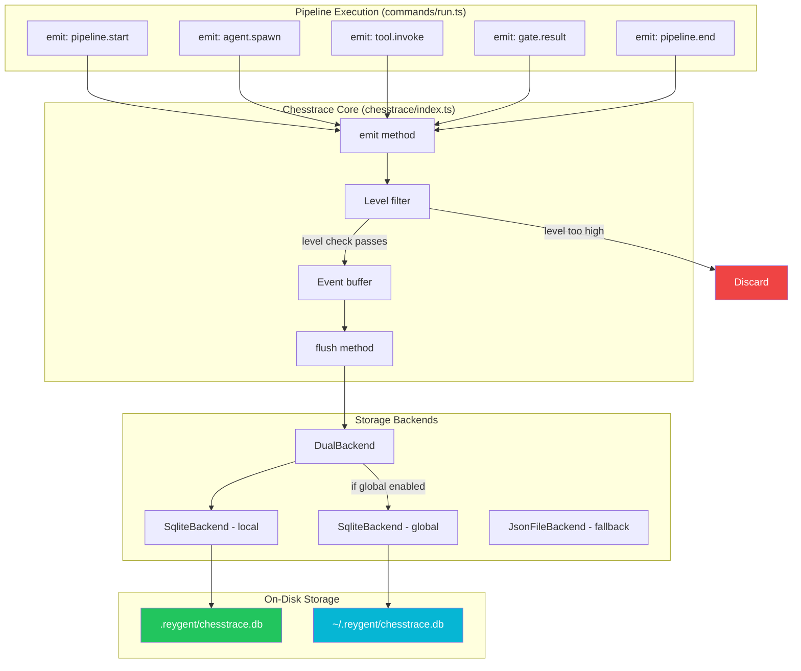
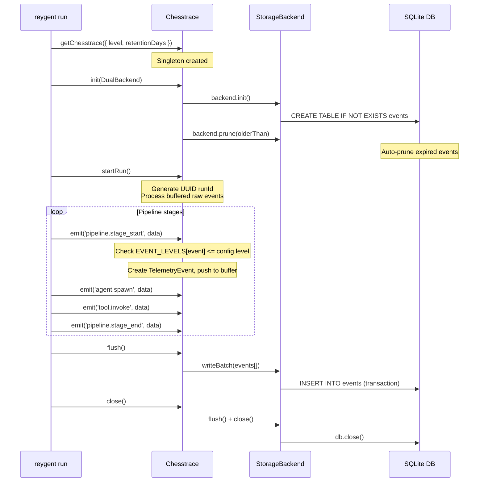
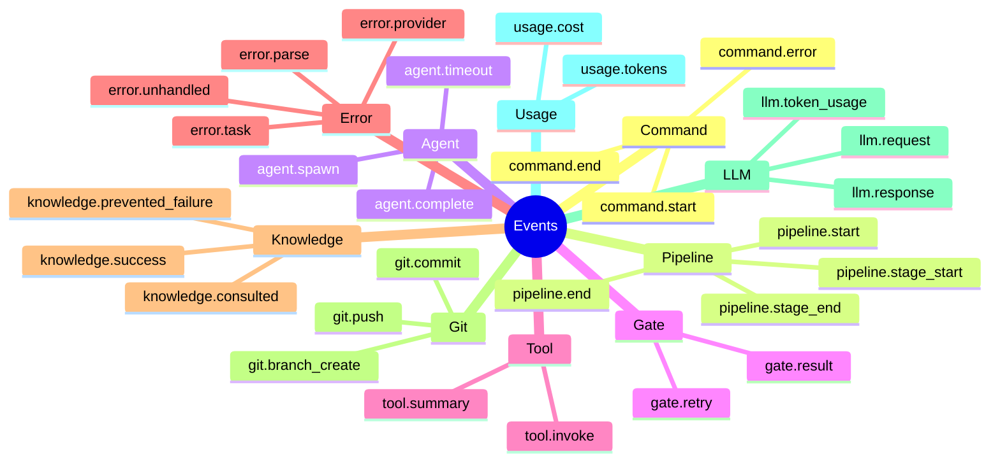
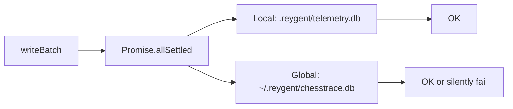
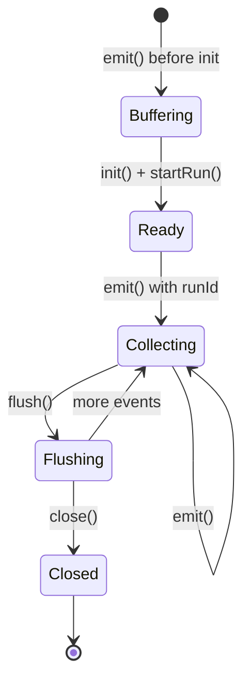

# Chesstrace


Chesstrace is Reygent's local telemetry engine. It captures pipeline execution events, stores them in SQLite, and powers the `reygent last`, `reygent analyze`, and `reygent telemetry` commands.

All data stays on your machine. Nothing is sent externally.

## Architecture Overview



## Data Flow: Full Lifecycle



## Event System

### Telemetry Levels

Events are filtered by level before storage. Higher levels include all lower-level events.

| Level | Value | Use Case |
|-------|-------|----------|
| `minimal` | 0 | Critical events only. CI/production. |
| `standard` | 1 | Normal usage. Default for interactive. |
| `verbose` | 2 | Full diagnostics. Debugging Reygent itself. |

### Event Categories



### Event Level Mapping

| Level | Events |
|-------|--------|
| **minimal** | `command.*`, `error.*`, `tool.summary`, `knowledge.prevented_failure` |
| **standard** | `agent.*`, `pipeline.*`, `gate.*`, `git.*`, `spec.*`, `tool.invoke`, `knowledge.consulted`, `knowledge.success` |
| **verbose** | `llm.*`, `performance.*`, `usage.*`, `tool.invoke.full` |

## Storage Backends

### SQLite Backend (Primary)

Default backend. Single `events` table with WAL mode.

```sql
CREATE TABLE events (
  id TEXT PRIMARY KEY,
  run_id TEXT NOT NULL,
  timestamp INTEGER NOT NULL,
  category TEXT NOT NULL,
  event TEXT NOT NULL,
  min_level INTEGER NOT NULL,
  data TEXT NOT NULL          -- JSON serialized
);

-- Indexes
CREATE INDEX idx_events_run_id ON events(run_id);
CREATE INDEX idx_events_timestamp ON events(timestamp);
CREATE INDEX idx_events_category ON events(category);
CREATE INDEX idx_events_event ON events(event);
```

**Security guards:**
- Max DB size: 50MB (auto-prunes 180-day-old events if exceeded)
- Max events per run: 10,000 (prevents spam)
- Symlink detection on atomic writes

### JSON File Backend (Fallback)

Used when SQLite is unavailable. Append-only JSONL files with daily rotation.

```
.reygent/chesstrace/
├── 2025-05-10.jsonl
├── 2025-05-11.jsonl
└── 2025-05-12.jsonl
```

Each line is a complete `TelemetryEvent` JSON object.

### Dual Backend

Production default. Writes to both local and global databases simultaneously using `Promise.allSettled()` (one failure doesn't block the other).



Queries read from **local only** (project-scoped data).

Disable global writes for security:
```bash
export REYGENT_GLOBAL_TELEMETRY=false
```

## Configuration

### Config file (`.reygent/config.json`)

```json
{
  "telemetry": {
    "enabled": true,
    "level": "standard",
    "backend": "sqlite",
    "retention": 30
  }
}
```

| Field | Type | Default | Description |
|-------|------|---------|-------------|
| `enabled` | `boolean \| undefined` | `undefined` | `undefined` = prompt on first run |
| `level` | `"minimal" \| "standard" \| "verbose"` | `"standard"` | Event capture threshold |
| `backend` | `"sqlite"` | `"sqlite"` | Storage backend |
| `retention` | `number` | `30` | Days to retain events |

### Environment Variables

| Variable | Effect |
|----------|--------|
| `REYGENT_TELEMETRY=false` | Disable all telemetry |
| `REYGENT_GLOBAL_TELEMETRY=false` | Disable global DB writes |
| `REYGENT_DEBUG=telemetry` | Enable debug logging for telemetry |
| `REYGENT_TELEMETRY_DB=/path` | Custom DB location |

### First-Run Prompt

On first interactive run, Chesstrace prompts for opt-in:

```
First-run telemetry setup
Reygent can collect local usage data to help diagnose issues.
Data is stored locally in SQLite and never sent to external servers.

? Enable local telemetry? (y/N)
```

**Never prompts in non-TTY** (CI, piped input, automated scripts).

## Commands That Use Chesstrace

| Command | What it reads |
|---------|--------------|
| `reygent last` | Latest run events (summary, verbose, errors, output) |
| `reygent analyze failures` | Error events grouped by pattern |
| `reygent analyze success` | Success patterns from agent/pipeline events |
| `reygent analyze costs` | Usage events for cost breakdown |
| `reygent analyze agents` | Agent spawn/complete events for performance |
| `reygent telemetry status` | DB metadata (size, run count, config) |
| `reygent telemetry runs` | Run summaries from `listRuns()` |
| `reygent telemetry prune` | Deletes events older than threshold |

## Security

### What IS Collected

- Run timestamps and duration
- Agent names and execution stages
- Error messages (**sanitized**)
- API costs (tokens, provider, model)
- Success/failure status
- File paths (relative to project root)
- Knowledge consultation events

### What is NOT Collected

- File contents or source code
- Environment variables or secrets
- API keys or tokens
- Network request bodies
- User-specific data beyond project paths

### Error Sanitization

All error messages pass through sanitization (`knowledge/analyzer.ts`) before storage:

| Pattern | Replacement |
|---------|-------------|
| API keys/tokens (20+ chars) | `[REDACTED]` |
| User home paths | `[HOME]/...` |
| Email addresses | `[EMAIL]` |
| IP addresses | `[IP]` |
| Env var values (`key=secret`) | `key=[REDACTED]` |

### Cross-Project Isolation

Global DB aggregates data from all projects. Risk: a public project's analysis could reveal patterns from private projects.

**Mitigation:** Set `REYGENT_GLOBAL_TELEMETRY=false` to write only to project-local DB.

## Internals

### Singleton Pattern

```typescript
import { getChesstrace, resetChesstrace } from './chesstrace/index.js';

// First call creates instance
const ct = getChesstrace({ level: TelemetryLevel.standard, retentionDays: 30 });

// Subsequent calls return same instance (config param ignored)
const ct2 = getChesstrace(); // same instance

// Reset for testing
resetChesstrace();
```

### Event Buffering

Events emitted before `init()` or `startRun()` are buffered in `rawEventBuffer`. Once `startRun()` is called, buffered events are processed (level-filtered) and assigned the new `runId`.



### File Locations

| Scope | Database | Fallback |
|-------|----------|----------|
| Local (project) | `.reygent/chesstrace.db` | `.reygent/chesstrace/*.jsonl` |
| Global (user) | `~/.reygent/chesstrace.db` | `~/.reygent/chesstrace/*.jsonl` |
| Dual (default) | Both local + global | — |

### Pruning Strategy

1. **On init**: Auto-prune events older than `retention` days
2. **On write**: If DB > 50MB, prune events older than 180 days + VACUUM
3. **Manual**: `reygent telemetry prune --older-than 30d`
4. **JSON backend**: Delete entire files if all events old; rewrite file if partial

## Troubleshooting

**Telemetry not recording:**
```bash
echo $REYGENT_TELEMETRY           # Should be empty or "true"
ls -la .reygent/chesstrace.db     # Should exist and be writable
REYGENT_DEBUG=telemetry reygent run ...  # See debug output
```

**DB too large:**
```bash
reygent telemetry prune --older-than 7d
# Or manually:
sqlite3 .reygent/chesstrace.db "VACUUM;"
```

**Events missing:**
- Check telemetry level — `minimal` only captures errors and summaries
- Check `telemetry.enabled` is `true` in config
- Verify DB path: `REYGENT_DEBUG=telemetry` shows which file is used
