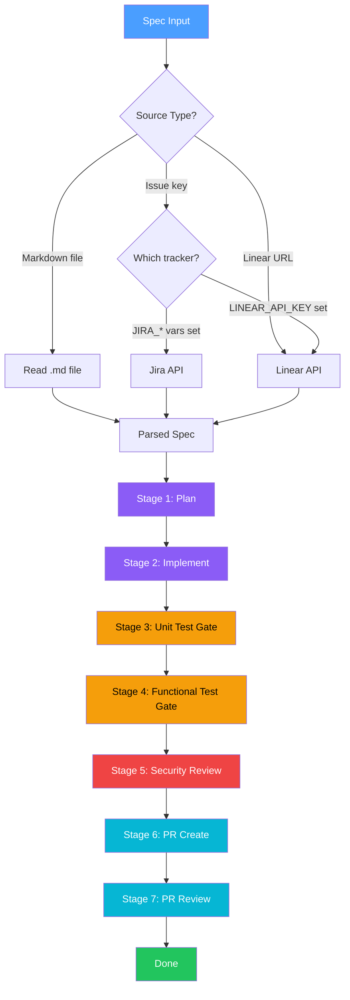
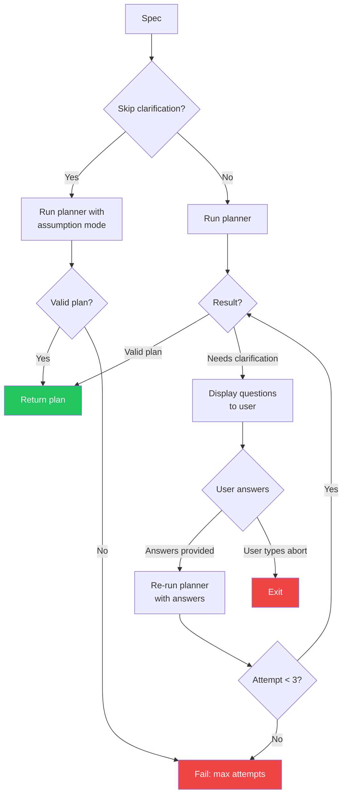
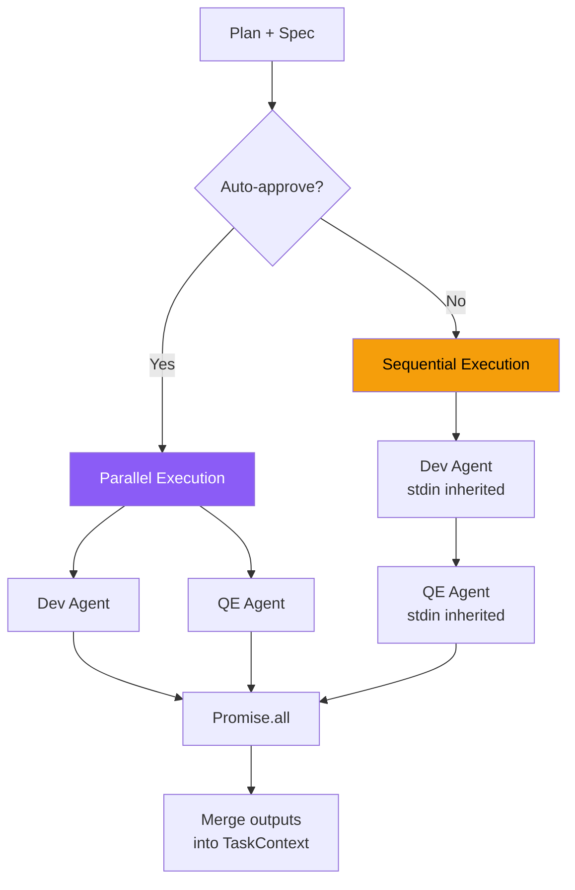
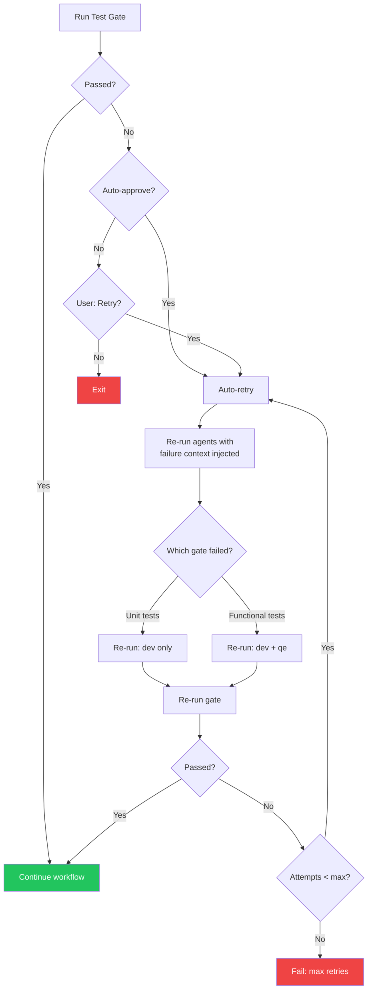
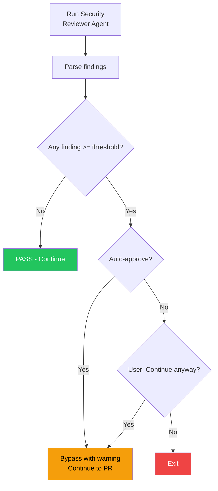
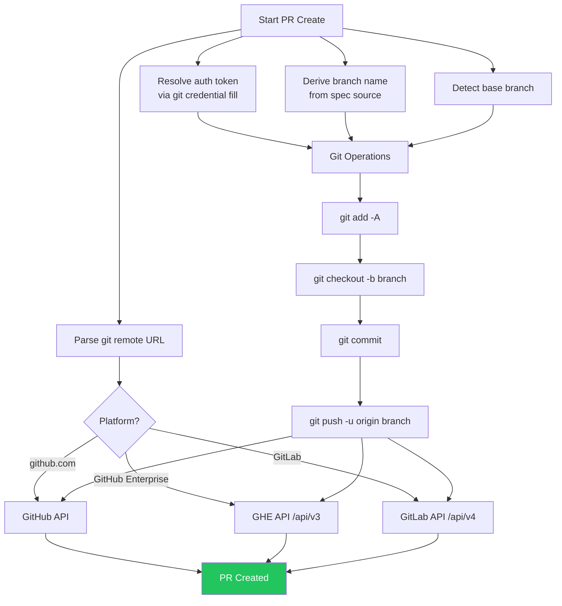
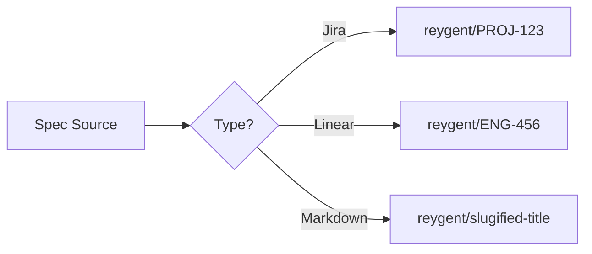
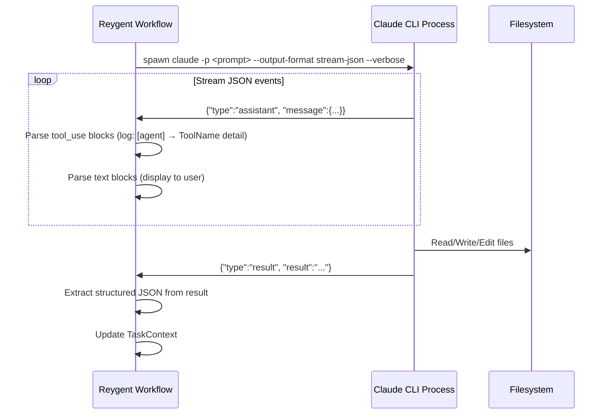
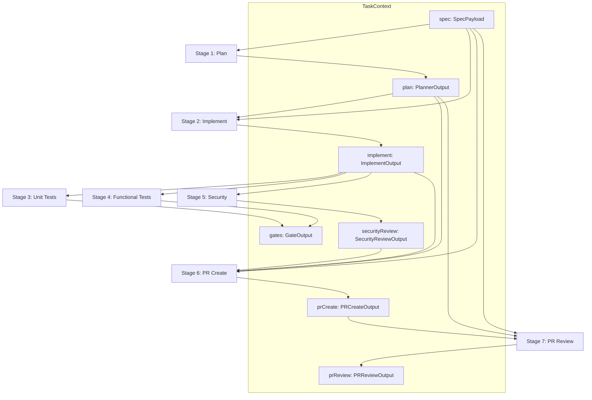

# Reygent Workflow

Visual diagrams of the reygent workflow, decision flows, and agent interactions.

## Full Workflow Overview

The complete reygent workflow from spec input to reviewed pull request:

## Planner Clarification Loop

How the planner resolves ambiguous specs:

## Implementation Stage

Dev and QE agent execution based on mode:

## Test Gate Retry Flow

What happens when tests fail:

## Security Review Decision Flow

## PR Creation Flow

How reygent creates a pull request:

## Branch Naming Convention

## Agent Spawning Internals

How each agent subprocess works:

## Complete Data Flow

How `TaskContext` flows through the reygent workflow:

